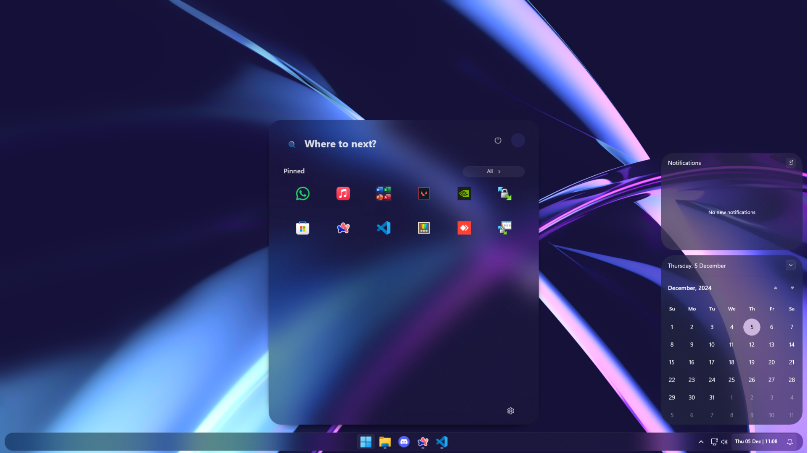
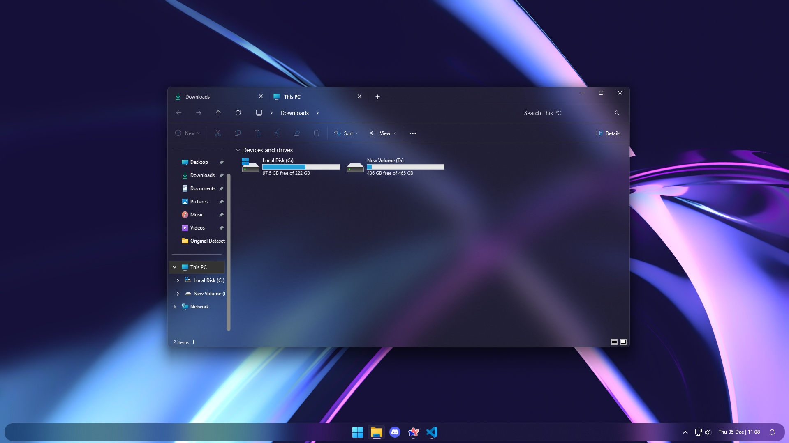
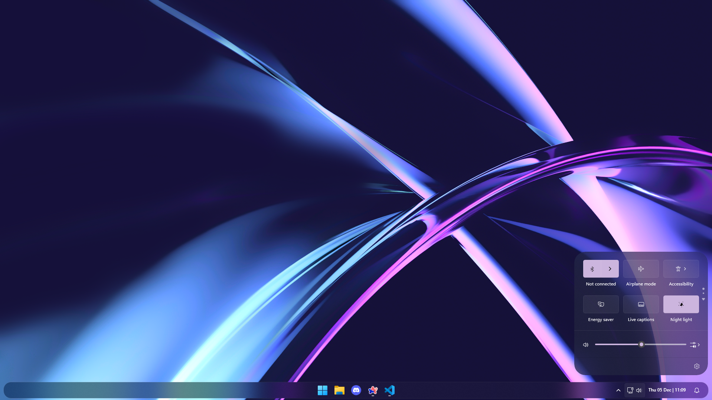

# Windows-11-Customizer
A collection of advanced Windhawk mod settings for personalizing Windows 11. This project enables customizations of the taskbar, start menu, notification bar, clock, and theme, offering an unparalleled level of user-defined personalization.

# Windows 11 Customizer: Advanced Windhawk Mod Settings

## Overview
This project provides advanced customization settings for the **Windhawk app**, allowing you to tweak and modify key elements of Windows 11, including the:
- Taskbar
- Start Menu
- Notification Bar
- Clock
- Windows Theme
- Windows Explorer (via [ExplorerBlurMica](https://github.com/Maplespe/ExplorerBlurMica))

Unlock the full potential of Windows 11's interface and design it to suit your needs.


## Features
- Modify the Windows 11 taskbar for unique layouts and functionality.
- Personalize the Start Menu appearance and behavior.
- Customize notification bar elements to streamline alerts.
- Adjust the clock design for style and usability.
- Create tailored Windows themes for a cohesive aesthetic.

## Screenshots
Here are a few examples of the customizations in action:

### Customized Taskbar and Start Menu


### Enhanced Windows Explorer


### Customized Quick Tiles
 

## Requirements
- Windows 11
- [Windhawk](https://windhawk.net) application
- [ExplorerBlurMica](https://github.com/Maplespe/ExplorerBlurMica) for Windows Explorer modifications.


## Setup Instructions

### 0. Clone Repository
1. Clone this repository:
```bash
   git clone https://github.com/ShubhamGajjar/windows-11-customizer.git
```

### 1. Install Windhawk
- Download and install Windhawk from its [official website](https://windhawk.net).

### 2. Install Required Mods
- Open the Windhawk app.
- Go to the "Mods" section to browse installed mods.
- Ensure the following mods are installed:
  - **Slick Window Arrangement**
  - **Taskbar Clock Customization**
  - **Taskbar Height and Icon Size**
  - **Taskbar Labels for Windows 11**
  - **Windows 11 Notification Center Styler**
  - **Windows 11 Start Menu Styler**
  - **Windows 11 Taskbar Styler**

### 3. Import or Copy Advanced Settings
- Select a mod (e.g., Taskbar, Start Menu, Notification Center, Clock, etc.).
- Click on **Details** and then go to the **Advanced** tab.
- Choose one of the following options:
  - **Import Settings**: Click "Import" and upload the corresponding `.whk` file from the `mods/` folder in this repository.
  - **Copy Code**: Open the `.whk` file in any text editor, copy the code, and paste it into the input box in Windhawk's Advanced settings.

### 4. Save and Restart
- After importing or pasting the settings, click **Save** to activate the mod.
- Restart your system (if required) to see the changes.


## Usage
1. Review the included .whk configuration files in the mods/ folder.
2. Edit settings to match your preferences (if required).
3. Apply modifications using the Windhawk app as described in the installation steps.
4. For Windows Explorer, follow the instructions from the ExplorerBlurMica repository.


## Acknowledgments
This project draws inspiration and support from:
- [Windhawk](https://windhawk.net) for its powerful modding capabilities.
- [ExplorerBlurMica](https://github.com/Maplespe/ExplorerBlurMica) for enabling stunning Mica blur effects in Windows Explorer.


## Contributing
We welcome contributions to enhance the functionality of this project. If you'd like to contribute:

1. Fork this repository.
2. Create a new branch (feature-branch).
3. Commit your changes.
4. Submit a pull request.


## License
This project is licensed under the [MIT License](/LICENSE).


## Disclaimer
These customizations are for personal use only. Ensure you create backups of your system before applying any mods.
